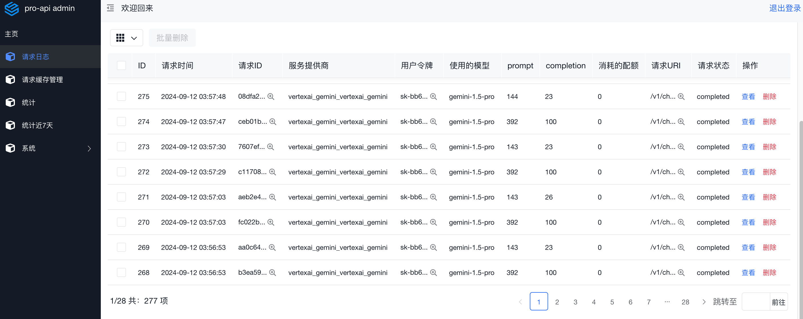
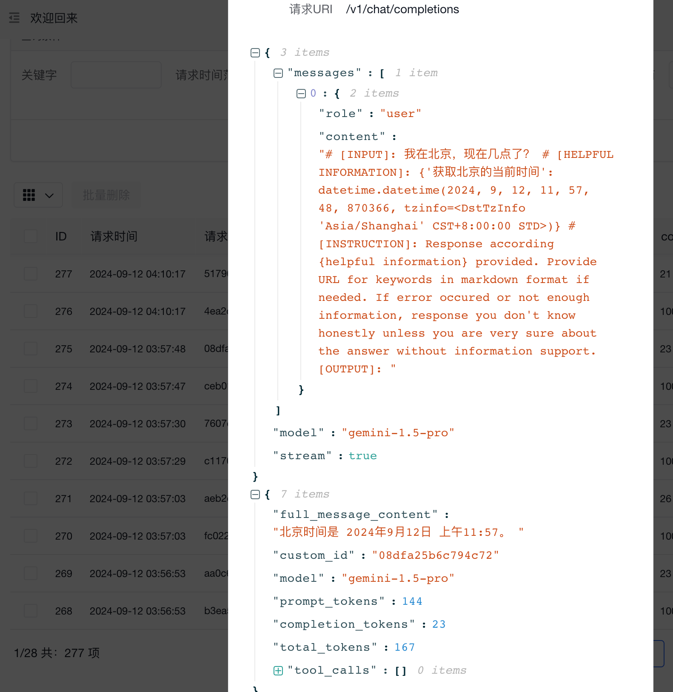
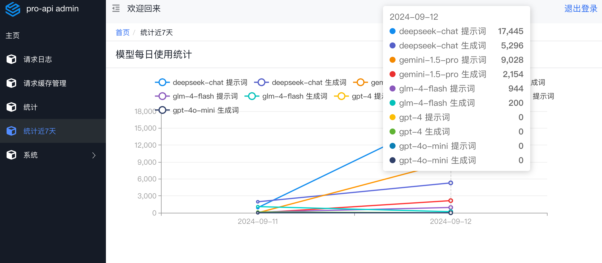

# pro-api

<p align="center">
   <a href="https://hub.docker.com/repository/docker/duolabmeng/pro-api">
    
  </a>
</p>

[English](./README.md)
[简体中文](./README_CN.md)


## 介绍

这是一个统一管理大模型API的项目，可以通过OpenAI 的API接口格式调用多个后端服务。该项目旨在简化与不同AI模型的交互，支持多种后端服务的调用。

## 支持的后端服务

目前支持的后端服务有：OpenAI、Anthropic、Gemini、Vertex、Cloudflare、DeepBricks、OpenRouter等。

## 后台功能

后台提供请求日志查询和使用统计查询。若不启动后台，则仅进行请求转发，不记录任何信息。








## 配置

使用 `api.yaml` 配置文件，可以配置多个模型，每个模型可以配置多个后端服务，支持负载均衡。以下是 `api.yaml` 配置文件的示例：


api.yaml
```
providers:
  - provider: openai # 服务提供商
    name: 智谱清言 # 服务名称
    base_url: https://open.bigmodel.cn/api/paas/v4 # 服务地址
    api_key: 请填写你的api_key
    model:
      - glm-4-flash # 模型名称
      

  - provider: gemini
    name: Gemini
    base_url: https://generativelanguage.googleapis.com/v1beta
    api_key: 请填写你的api_key
    model:
      - gemini-1.5-pro
      - gemini-1.5-flash
      - gemini-1.5-flash: gpt-4o
    balance: # 配置负载均衡 不配置默认为1
      - gemini-1.5-pro: 1 #表示这个名称下的模型权重是1
      - gemini-1.5-flash: 1 #表示这个名称下的模型权重是2
      - gemini-flash: 1 #表示这个名称下的模型权重是2


  - provider: openai
    name: 豆包
    base_url: https://ark.cn-beijing.volces.com/api/v3
    api_key: 请填写你的api_key
    model:
      - ep-20240906033439-zrc2x: doubao-pro-128k # 可以简化模型名称为 doubao-pro-128k
      - ep-20240613130011-c2zgx: doubao-pro-32k
      - ep-20240729175503-5bbf7: moonshot-v1-128k

  - provider: openai
    name: 硅基流动
    base_url: https://api.siliconflow.cn/v1
    api_key: 请填写你的api_key
    model:
      - Qwen/Qwen2-72B-Instruct: qwen2-72b
      - Qwen/Qwen1.5-110B-Chat: qwen1.5-110b
      - deepseek-ai/DeepSeek-V2-Chat: deepseek-chat
      - deepseek-ai/DeepSeek-Coder-V2-Instruct: deepseek-coder
      - Qwen/Qwen2-7B-Instruct: qwen2-7b
      - Qwen/Qwen2-7B-Instruct: gpt-3.5-turbo
      - Qwen/Qwen2-1.5B-Instruct: qwen2-1.5b
      - Qwen/Qwen1.5-7B-Chat: qwen1.5-7b-chat
      - THUDM/glm-4-9b-chat: glm-4-9b-chat
      - THUDM/chatglm3-6b: chatglm3-6b
      - 01-ai/Yi-1.5-9B-Chat-16K: yi-1.5-9b-chat-16k
      - 01-ai/Yi-1.5-6B-Chat: yi-1.5-6b-chat
      - google/gemma-2-9b-it: gemma-2-9b
      - internlm/internlm2_5-7b-chat: internlm-7b-chat
      - meta-llama/Meta-Llama-3-8B-Instruct: meta-llama-3-8b
      - meta-llama/Meta-Llama-3.1-8B-Instruct: meta-llama-3.1-8b
      - mistralai/Mistral-7B-Instruct-v0.2: mistral-7b


  - provider: openai
    name: deepseek
    base_url: https://api.deepseek.com/v1
    api_key: 请填写你的api_key
    model:
      - deepseek-chat
      - deepseek-coder


  - provider: vertexai_claude
    name: vertexai_claude
    PROJECT_ID: 请填写
    CLIENT_ID: 请填写
    CLIENT_SECRET: 请填写
    REFRESH_TOKEN: 请填写
    model:
      - claude-3-5-sonnet@20240620
      - claude-3-5-sonnet@20240620: claude-3-5-sonnet

  - provider: vertexai_gemini
    name: vertexai_gemini
    PROJECT_ID: 请填写
    CLIENT_ID: 请填写
    CLIENT_SECRET: 请填写
    REFRESH_TOKEN: 请填写
    model:
      - gemini-1.5-flash-001


  - provider: cohere
    name: cohere
    base_url: https://api.cohere.com/v1
    api_key: 请填写
    model:
      - command-r-plus-08-2024
      - command-r-plus-04-2024: gpt-4
      - command-r-plus
      - command-nightly
      - command-light
      - command-light-nightly

  - provider: cloudflare
    name: cloudflare
    api_key: 请填写
    account_id: 请填写
    model:
      - "@cf/qwen/qwen1.5-14b-chat-awq": qwen1.5-14b
      - "@hf/thebloke/deepseek-coder-6.7b-instruct-awq"


  - provider: openai
    name: openrouter
    base_url: https://openrouter.ai/api/v1
    api_key: s请填写
    model:
      - mattshumer/reflection-70b:free: reflection-70b
      - nousresearch/hermes-3-llama-3.1-405b:free: llama-3.1-405b


tokens:
  - api_key: sk-111111
    model:
      - glm* # 可以使用通配符*
      - all # all 代表全部都可以

  - api_key: sk-222222
    model:
      - gpt-3.5-turbo

server:
    default_model: glm-4-flash # 如果匹配不到，则使用这个默认的模型
    debug: false
    admin_server: false # 是否启动后台功能 如果不启动则只转发不作任何记录
    db_cache: false # 相同内容的情况下返回上一次成功的回复
    save_log_file: false
    db_path: sqlite:///./data/request_log.db
    username: admin # 后台用户名
    password: admin # 后台密码
    jwt_secret_key: admin # 随便填不填就随机
```

[vertexai的参数获取教程](./docs/vertexai的参数获取教程.md)

# 配置负载均衡

可以对相同模型名称的模型进行负载均衡

默认权重为1 

```
  - provider: gemini
    name: Gemini1
    base_url: https://generativelanguage.googleapis.com/v1beta
    api_key: 请填写
    model:
      - gemini-1.5-pro
      - gemini-1.5-flash
      - gemini-1.5-flash : gemini-flash
    balance: # 负载均衡
      - gemini-1.5-pro: 1 #表示这个名称下的模型权重是1
      - gemini-1.5-flash: 1 #表示这个名称下的模型权重是2
      - gemini-flash: 1 #表示这个名称下的模型权重是2

  - provider: gemini
    name: Gemini2
    base_url: https://generativelanguage.googleapis.com/v1beta
    api_key: 请填写
    model:
      - gemini-1.5-pro
      - gemini-1.5-flash
      - gemini-1.5-flash : gemini-flash
    balance: # 负载均衡
      - gemini-1.5-pro: 2 #表示这个名称下的模型权重是1
      - gemini-1.5-flash: 2 #表示这个名称下的模型权重是2
      - gemini-flash: 3 #表示这个名称下的模型权重是2
```
以上配置讲解:

比如:

当前权重信息

* Gemini1 的 gemini-1.5-flash 权重1
* Gemini2 的 gemini-1.5-flash 权重2

请求 gemini-1.5-flash 的时候

- 第1次 Gemini1 的 gemini-1.5-flash
- 第2次 Gemini2 的 gemini-1.5-flash
- 第3次 Gemini2 的 gemini-1.5-flash
- 第4次 Gemini1 的 gemini-1.5-flash
- 第5次 Gemini2 的 gemini-1.5-flash


## vercel 部署


点击下面的按钮一键部署到 Vercel：

[](https://vercel.com/new/clone?repository-url=https%3A%2F%2Fgithub.com%2Fduolabmeng6%2Fpro-api&env=config_url,secret_key&project-name=pro-api&repository-name=pro-api)

部署时需要设置以下环境变量：

- `config_url`: 远程配置文件的 URL
- `secret_key`: 用于加密的密钥（如果不需要加密，可以留空）如果需要加密，请使用 aes-128-ecb 加密 不加密就给明文的配置内容

部署完成后，访问 Vercel 分配的域名即可使用 API。

注意：请确保您的远程配置文件 (`config_url`) 可以被公开访问，否则 Vercel 将无法获取配置信息。

这里我给一个最简单配置内容

config_url=https://可以访问下载配置的地址/api.yaml

```
providers:
  - provider: openai
    name: deepseek
    base_url: https://api.deepseek.com/v1
    api_key: sk-xxxxxxxxxxxxx
    model:
      - deepseek-chat
      - deepseek-coder

tokens:
  - api_key: sk-123456
    model:
      - all

server:
    default_model: deepseek-chat

```


## Docker 本地部署

启动容器

1. 使用本地api.yaml配置文件启动
```bash
docker run -d \
  --name pro-api \
  -p 8001:8000 \
  -v $(pwd)/api.yaml:/app/api.yaml \
  -v $(pwd)/data:/app/data:rw \
  duolabmeng/pro-api:latest
```

2. 使用远程api.yaml配置文件启动
```bash
docker run -d \
  --name pro-api \
  -e config_url=http://你的服务器/api.yaml \
  -e secret_key=123456789 \
  -p 8001:8000 \
  -v $(pwd)/api.yaml:/app/api.yaml \
  -v $(pwd)/data:/app/data:rw \
  duolabmeng/pro-api:latest
```
config_url 自动下载远程的配置文件 
secret_key 用aes加密,ECB,128位,如果你要安全记得启动aes密码,不填就给明文的配置内容


3. 如果你想使用 Docker Compose
```yaml
services:
  pro-api:
    container_name: pro-api
    image: duolabmeng/pro-api:latest
    environment:
      - config_url=http://file_url/api.yaml
      - secret_key=123456789
    ports:
      - 8001:8000
    volumes:
      - ./api.yaml:/app/api.yaml
      - ./data/:/app/data:rw
```

比如你在某个平台不方便修改配置文件，可以把配置文件传到某个托管服务，可以提供直链给 pro-api 下载，config_url 就是这个直链。
如果你不想重启容器更新配置访问 /reload_config 即可重新下载刷新配置。


一键重启 Docker 映像

```bash
set -eu
docker pull duolabmeng/pro-api:latest
docker rm -f pro-api
docker run --user root -p 8001:8000 -dit --name pro-api \
-v ./api.yaml:/app/api.yaml \
duolabmeng/pro-api:latest
docker logs -f pro-api
```

RESTful curl 测试

```bash
curl -X POST http://127.0.0.1:8000/v1/chat/completions \
-H "Content-Type: application/json" \
-H "Authorization: Bearer ${API}" \
-d '{"model": "gpt-4o","messages": [{"role": "user", "content": "Hello"}],"stream": true}'
```

# 帮助

1.如果在一些云平台不能安装依赖那么你可以直接把依赖安装到运行的目录然后启动

```shell
pip install -r requirements.txt --no-user -t ./app 

```

## Star 记录
<a href="https://github.com/duolabmeng6/pro-api/stargazers">
        
</a>

# 赞赏

如果觉得项目对你有帮助，可以请作者喝杯咖啡

