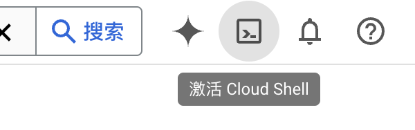
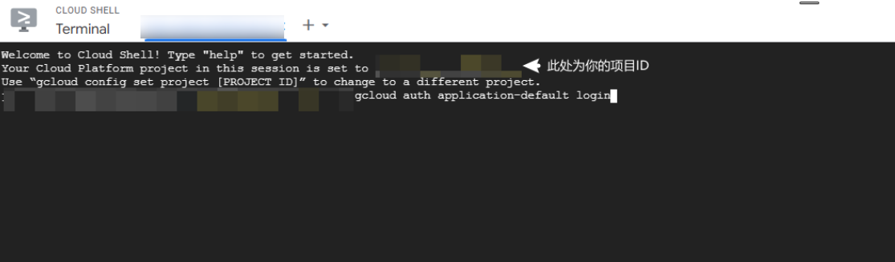
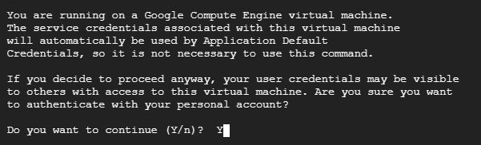
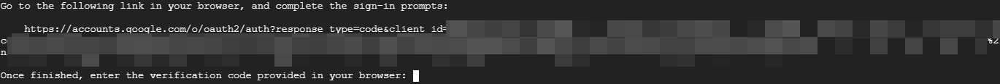
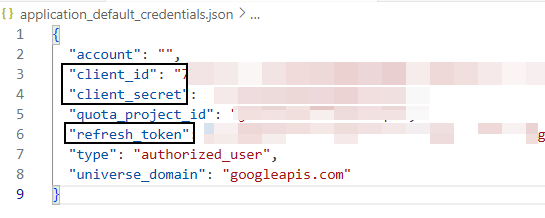

# 打开页面

https://console.cloud.google.com/vertex-ai

随便打开一个 看到右上角




**执行以下命令**
Google cloud shell执行

```bash
gcloud auth application-default login
```










1. **点击链接并完成授权**
   这里出现一段链接，鼠标点击一下这个链接，打开之后一路允许，随后出现下面这个界面，点一下Copy复制下面的验证码

   

   

   

2. **返回Cloud Shell，粘贴验证码并确认**
   回去刚刚的界面鼠标右键粘贴，然后回车确认

   

   

   

3. **[验证文件（密钥）] 的保存位置**
   接着提示验证文件保存在了这个位置

   

   

4. **查看验证文件内容**
   使用cat空格加这个路径进行查看，比如我这里是

   ```bash
   cat /tmp/tmp.ABCD/application_default_credentials.json
   ```

   从里面复制出三个值保留备用，project_id就是项目ID这个也要用到
   


# 把参数收集好填进来就可以了

PROJECT_ID 就是你创建项目的时候看见的

```
  - provider: vertexai_claude
    name: vertexai_claude
    PROJECT_ID: 请填写
    CLIENT_ID: 请填写
    CLIENT_SECRET: 请填写
    REFRESH_TOKEN: 请填写
    model:
      - claude-3-5-sonnet@20240620
      - claude-3-5-sonnet@20240620: claude-3-5-sonnet
```


# 测试 claude

```
curl --request POST \
  --url http://127.0.0.1:8000/v1/chat/completions \
  --header 'Authorization: Bearer sk-111111' \
  --header 'Content-Type: application/json' \
  --data '{
    "model": "claude-3-5-sonnet",
    "stream": false,
    "messages": [
        {
            "role": "user",
            "content": "你是什么模型"
        }
    ]
}'
```

返回例子

```
{
    "id": "chatcmpl-75bf4b37-f220-4bd1-9320-c76042d6ab6d",
    "object": "chat.completion",
    "created": 1726029580,
    "model": "claude-3-5-sonnet",
    "choices": [
        {
            "index": 0,
            "message": {
                "role": "assistant",
                "content": "我是由Anthropic公司开发的AI助手Claude。我没有实体形态,是一个语言模型,可以进行对话交互。我的具体架构细节我并不了解,如果你感兴趣的话可以去查阅Anthropic公司发布的相关信息。",
                "tool_calls": null
            },
            "finish_reason": "stop"
        }
    ],
    "usage": {
        "prompt_tokens": 14,
        "completion_tokens": 87,
        "total_tokens": 101
    }
}
```


# 如果是Gemini的话


```
  - provider: vertexai_gemini
    name: vertexai_gemini
    PROJECT_ID: 请填写
    CLIENT_ID: 请填写
    CLIENT_SECRET: 请填写
    REFRESH_TOKEN: 请填写
    model:
      - gemini-1.5-flash-001
```

```
curl --request POST \
  --url http://127.0.0.1:8000/v1/chat/completions \
  --header 'Authorization: Bearer sk-111111' \
  --header 'Content-Type: application/json' \
  --data '{
    "model": "gemini-1.5-flash-001",
    "stream": false,
    "messages": [
        {
            "role": "user",
            "content": "你是什么模型"
        }
    ]
}'
```


```
{
    "id": "chatcmpl-7bd22a54-20dc-4b04-b770-46ac0ba86dc3",
    "object": "chat.completion",
    "created": 1726029710,
    "model": "gemini-1.5-flash-001",
    "choices": [
        {
            "index": 0,
            "message": {
                "role": "assistant",
                "content": "我是一个大型语言模型，由 Google 训练。",
                "tool_calls": null
            },
            "finish_reason": "stop"
        }
    ],
    "usage": {
        "prompt_tokens": 3,
        "completion_tokens": 11,
        "total_tokens": 14
    }
}
```

